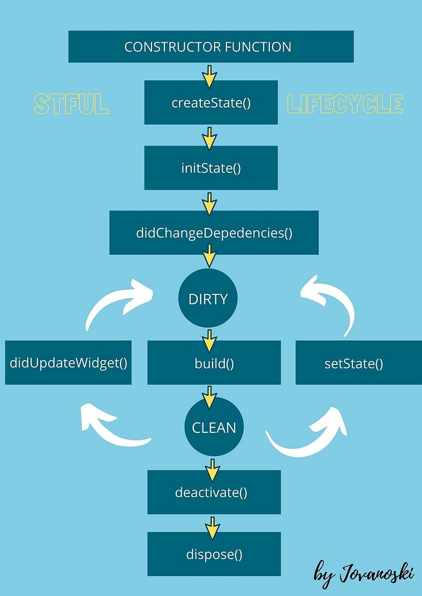

본격적인 플러터 개발에 들어가기 전 이론무장한 내용을 정리한다. 주기적으로 반복해서 읽어보며 미흡한 내용을 보완해 나갈 것.

[공식문서](https://docs.flutter.dev/resources/architectural-overview)

# Flutter 아키텍처
Flutter는 레이어화 된 아키텍처로 구성되어 있다.각 레이어는 다른 레이어에 직접 접근할 수 없으며 추상화를 통해 의존한다. 각 레이어는 이렇게 하위 레이어에 의존하는 여러 라이브러리들의 집합으로 이루어져 있다.

## Framework Layer
Flutter 개발자는 이 Framework 레이어에서 앱을 개발한다.

#### Material/Cupertino Layer
Material과 Cupertino의 디자인을 구현하기 위해 아래쪽 Widget Layer의 구성 요소들을 조합한 포괄적인 set를 제공한다.

#### Widget Layer
Composition이 추상화된 계층이다. 이 Layer에서 개발자는 여러 Widget 클래스들의 조합을 정의하여 코드에서 재사용 할 수 있다. 각 Widget Object는 Rendering Layer에서 대응되는 Render Object가 있다.

*  [Widget index](https://docs.flutter.dev/reference/widgets)

#### Rendering Layer
Render tree를 다루기 위한 추상화 계층이다.

#### Foundation Layer
Framework의 가장 기초적인 클래스들과 기초적인 클래스들을 추상화 한 Animation, Painting, Gesture 등 서비스를 제공하여 상위 계층에서 범용적으로 사용할 수 있도록 한다.

## Engine Layer
Flutter의 핵심으로 모든 기능의 기초. 새 프레임이 그려질 때마다 조합된 scene을 래스터라이징한다. Flutter의 Core API(그래픽, Text Layout, I/O, accessibility support, plugin architecture, a Dart runtime and compile toolchain 등등)의 저수준 구현을 담당한다. Engine Layer는 dart:ui 패키지를 통해 상위 Framework Layer에 노출된다. 이 패키지는 Engine을 구성하는 C++코드를 Dart로 래핑하며, 최하위 구성 요소들(입력, 그래픽, text rendering subsystems등을 위한 클래스들)을 노출한다.

## Embedder Layer
Flutter 앱은 OS에서 다른 네이티브 앱들과 같은 방식으로 패키징 된다. Embedder는 각 네이티브 환경에서 사용되는 언어로 작성되어 있고, 이 Embedder를 통해 Flutter 코드는 앱에서 모듈의 형태로 소속되거나, 앱 컨텐츠 자체가 될 수 있다. Embedder는 각 OS환경에서 Flutter 앱으로의 entrypoint를 제공, 즉 Flutter framework를 호스팅한다. OS에서 제공하는 서비스(rendering surfaces, accessibility, input, manages the message event loope 등)에 엑세스 한다.

# Widgets
Widget은 Flutter앱을 구성하는 최소 단위이며 UI를 선언형으로 구성한다. 위젯은 계층구조가 있으며 빌드될 때 부모위젯으로부터 context를 전달받는다. 보통 MaterialApp이나 CupertinoApp이 최상단에서 root 역할을 맡는다.

유저 입력과 같은 UI변경 이벤트가 발생하면 App은 Framework에게 대상이 되는 기존 위젯을 새로운 위젯으로 변경할 것을 요청하고, Framework는 기존 위젯과 새 위젯을 비교, 교체함으로써 UI가 변경된다.

Flutter는 각 플랫폼에서 제공되는 UI컴포넌트를 사용하지 않고, 자체 구현된 UI를 사용한다. 이렇게 하면 개발자는 플랫폼의 한계에서 벗어나 자유롭게 UI를 커스터마이징할 수 있고, Flutter코드를 네이티브 코드로 변환하는 성능 낭비를 없앨 수 있으며 플랫폼의 동작 변경으로부터 자유로워질 수 있다.

Flutter는 가능한 디자인 개념을 최소로, 어휘는 최대로 유지하려고 노력한다. 예를 들어 Widget Layer에서는 모든 요소들이 Widget으로 표시된다. 마찬가지로 Animation Layer에서는 대부분의 것들이 Animation과 Tween개념으로 이루어져있고,
Rendering Layer에서는 RenderObject로 통한다.

Widget 클래스 계층구조는 조합가능성을 극대화 하기 위해 최대한 얕고 넓게 만들어져 있으며, 각각 Widget은 하나의 기능만 수행하도록 설계되어 있다. Padding이나 Alignment등의 추상적인 기능들도 Widget의 파라미터를 설정하는 대신 별도로 분리된 Widget을 사용해야 한다.

Flutter에는 눈에 보이는 표현없이 다른 위젯을 컨트롤하기만 하는 Widget들이 있다. 이러한 Widget은 내부에 여러 Widget들을 자유롭게 구성할 수 있어서 해당 class를 상속하지 않고도 원하는 효과를 유연하게 줄 수 있도록 해 준다. 예를 들어 Container는 LimitedBox, ConstrainedBox, Align, Padding, DecoratedBox, Transform 위젯으로 구성되는데, 각 위젯을 원하는 대로 정의할 수 있는 것이다.

build() 메서드를 override하여 해당 Widget이 나타내는 UI의 Tree를 반환한다. Framework는 완전한 renderable object widget tree가 완성될 때 까지 재귀적으로 모든 Widget의 build()를 호출한다.

build() 메서드는 사이드 이펙트가 없어야 한다. Framework는 render object tree를 기반으로 어떤 위젯이 build()되어야 하는지 탐색한다. 각 프레임마다 state가 변경된 Widget을 다시 build()한다. 따라서 build()의 실행은 빨라야 하며, 오랜 작업은 비동기적으로 실행 후 결과물을 state로써 관리해야 한다.

build() 메서드에 상태별 UI를 선언해 둠으로써 UI의 변경보다는 state의 변경에 집중할 수 있게 된다.

Widget 그 자체는 수정 불가한 객체이다. 일단 build()되면 위젯 Tree상에서 수정될 수 없는 것이다. 무조건 새로 생성 후 교체되어야 한다.

## State

Widget은 state로 사용되는 내부 프로퍼티가 있는 StatefulWidget, 그렇지 않은 StatelessWidget으로 크게 분류된다. StatefulWidget은 state를 관리하기 위해 별도의 State클래스의 서브클래스를 가지며, build()메소드도 이 클래스에서 정의된다. state가 변하고 Widget의 갱신이 필요하면 setState()를 호출해야 한다. state를 별도의 State클래스에서 관리함으로써 StatefulWidget은 state의 유실 위험없이 StatelessWidget과 같은 방식으로 취급이 가능하다. state보존을 위해 Widget을 유지할 필요없이, 언제든 필요하면 폐기 후 다시 생성할 수 있는 것이다.

일반적으로 state는 부모로부터 자식으로 생성자를 통해 전달된다. 그러나 위젯 Tree가 깊어질 수록 이렇게 전달하도록 설정하는 것이 아주 번거로운 작업이 된다. 그래서 존재하는 것이 InheritedWidget이다. InheritedWidget을 상속하는 Widget의 자식이라면 어디서든 of(BuildContext)메서드를 통해 인스턴스에 접근할 수 있다. of()메서드는 호출하는 Widget으로부터 가장 가까운 같은 타입의 위젯을 찾아준다.

> Theme.of(context)는 Theme Widget을 반환한다.

또한 InheritedWidget은 updateShouldNotify()메서드를 제공하는데, 이는 특정 state의 변경시 Framework가 자식 Widget들에게 이를 알려야할 지 결정하기 위해 호출하는 메서드다.

Flutter Framework내에서도 Theme, Navigator등 광범위 하게 사용되고, provider등의 상태관리 기법에서도 사용된다.

# Rendering & Layout

Android 네이티브 앱에서 각 UI 컴포넌트는 스스로를 Canvas를 통해 그려야 할 책임을 갖는다. 이후 완성된 Canvas는 Skia엔진(C/C++로 작성된 그래픽 엔진)을 통해 렌더링 된다. 일반적으로 Javascript로 작성되는 크로스플랫폼 프레임워크는 Android와 iOS의 네이티브 UI 라이브러리의 상위에 존재하는 추상화 계층을 두고, 양 플랫폼간의 차이를 해소하려 한다. 하지만 이러한 방식은 JS의 UI와 네이티브 앱간의 소통이 많아지면 성능상 오버헤드를 발생시킨다.

반면 Flutter는 기존의 각 플랫폼의 네이티브 UI 라이브러리를 사용하지 않고, 자체적인 UI 툴킷을 가지고 있으며, 컴파일시 곧바로 Skia엔진이 사용하는 C/C++코드로 변환되기 때문에 서로 다른 플랫폼을 위한 추상화 계층이 최소화된다. 또한 Flutter의 engine Layer에 자체적인 Skia엔진을 가지고 있어 각 플랫폼OS의 업데이트와 무관하게 작동한다.

#### 렌더링 파이프라인 순서도

#### Widget, Element, Render Tree

#### 3. Build

Build단계에서 Flutter는 `Widget Tree`를 바탕으로 `Element Tree`를 생성한고, 이 Element Tree를 바탕으로 `Render Tree`까지 생성한다. Widget Tree의 각 Widget은 Element Tree상 같은 위치의 Element와 1:1대응되는데, Element는 2가지 타입이 있다.

1. ComponentElement : 다른 Element를 가지는 Element.
2. RenderObjectElement : Render Tree에 반영되어 실제로 렌더링 Element.

RenderObjectElement는 Widget과 Render Tree상의 RenderObject의 중간 과정이다. 각 Element는 BuildContext를 통해 Tree상 위치를 확인할 수 있다. BuildContext는 Widget Tree상 해당 Widget의 위치정보를 가지고 있다. 한번 build된 Widget은 불변이기 때문에 수정사항을 반영하는 방법은 새 객체를 build하여 교체하는 것 뿐이다. 하지만 Element Tree는 프레임이 지나가도 유지되기 때문에 Widget Tree상의 객체가 새로 생성되고 파괴되더라도, Element Tree상의 수정이 필요한 Element만 다시 build하면 되어 Flutter 전체가 좋은 성능을 가질 수 있다. 참고로 문서에 따르면 Widget객체를 새로 생성하는 건 자원이 많이 필요하지 않으며, 이러한 객체의 생성과 파괴를 빠르게 할 수 있는 언어가 Dart라고 한다.

#### 4~6. Rendering(Layout, Paint, Composition)

Render Tree의 대부분의 RenderObject클래스는 RenderBox클래스를 상속한다. RenderBox는 Box Constraint(Box의 가로, 세로의 최대, 최소값)정보를 통해 렌더링 될 RenderObject의 사이즈를 정의한다.

Layout은 렌더링 대상의 위치와 크기를 결정하는 것이다. 이를 위해 Flutter는 Render Tree를 깊이 우선탐색(DFS)으로 방문하며 각 부모로부터 자식들에게 Size Constraint를 하달하고, 자식들은 전달받은 Constraint 내에서 size를 결정하여 부모에게 올려보낸다. 부모는 Constraint의 max와 min value를 일치시켜서 자식의 크기를 강요할 수 있으며, width만 고정하고 height는 한도를 없애 유연하게 만들 수도 있다. 또한 자식은 자신의 Constraint를 가지고 스스로의 UI로직을 가질 수 있다. 한바퀴 순회가 종료되면 모든 RenderObject는 자신의 결정된 size를 가지게 되어, paint() 호출을 통해 Paint단계로 넘어가게 된다.

Render Tree의 루트에는 `RenderView`가 있다. 플랫폼에서 새로운 프레임을 요구하면 RenderView의 compositeFrame()이 호출되고, 이 메서드에서 SceneBuilder가 새로운 프레임 scene을 생성한다. 이 작업이 완료되면 새 scene을 dart:ui의 Window.render()메소드를 통해 Flutter Engine으로 전달하고 GPU에서 렌더링 된다.

# Widget Lifecycle

StatefulWidget의 Lifecycle만 기술한다.

1. createState() : State객체를 생성. 이후 백그라운드에서 Widget 내부의 `mounted` 속성이 true로 바뀌고, Widget tree에 등록되면서 BuildContext가 할당된다.

2. initState() : createState()이후에 1번 호출된다. stream 구독 등의 자원등록을 여기서 하면 좋다. 여기서 아직 BuildContext는 사용할 수 없다.

3. didChangeDependencies() : Widget이 최초 생성될 때 1번 호출되고, 이후 이 Widget이 참조하는 다른 Widget(주로 InheritedWidget)이 rebuild 될 때 호출된다. 이게 호출되면 이후 반드시 build()가 호출된다. InheritedWidget이 업데이트 될 때 딱 한번 network처리 등이 필요 할 때 override하면 좋다.

4. build() : Widget의 tree를 형성한다. state가 업데이트 될때, didChangeDependencies()나 didUpdateWidget()호출 이후 이어서 호출된다.

5. didUpdateWidget() : 부모가 변경되어 자식(현재 위젯)도 다시 build()되어야 하는 상황에서 호출. 이전 위젯과 새 위젯을 비교할 수 있도록 oldWidget 파라미터를 받는다.

6. setState() : 개발자와 프레임워크가 호출하며 State가 현재 build()가 필요한 dirty상태라는 것을 알려준다.

7. deactivate() : Widget이 tree로 부터 제거될 때 호출된다. 이 단계에서 아직 객체는 메모리에 남아있다. Widget이 tree로 부터 제거되더라도 다른 위치에 재삽입되는 케이스가 있는데(예를들어 GlobalKey 사용으로 인해 트리 내에서 위치를 옮긴 케이스라고 문서에 나와있는데 뭔소린지...), 이 때 재삽입 직후 activate()와 build()가 호출된다. 이 제거부터 재삽입까지의 과정은 모두 동일 애니메이션 프레임 내에서 완료된다. 그래서 Widget이 사용중인 자원의 해제는 dispose()로 미룰 수 있다. TODO 그럼 위젯이 재삽입이 안되고 dispose()되는 상황에서도 deactivate()가 호출되는지? 스크롤 같은 상황에서 발생하고, animation 중단 등을 위해 사용할 수 있고 하는데 이게 이 케이스가 맞는지?

8. dispose() : Widget이 tree로부터 완전히 제거될 때 호출된다. 구독중이던 stream 등 자원의 해제를 보통 여기서 한다. 이 때 `mounted`가 false가 된다.

# 기타 정리가 필요한 정보의 파편들
- 각 플랫폼은 shell을 통해 Dart VM을 호스팅한다.
- taskRunner란?
- [렌더링 파이프라인](https://medium.com/geekculture/why-is-flutter-fast-part-3-rendering-pipeline-3a31056355e5)
- [Isolate](https://velog.io/@ximya_hf/flutter-isolate) : 사용 연습 필요. 근데 사용할 일이 있을지?