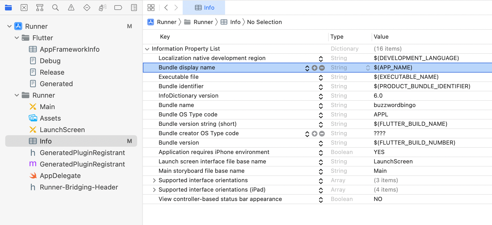
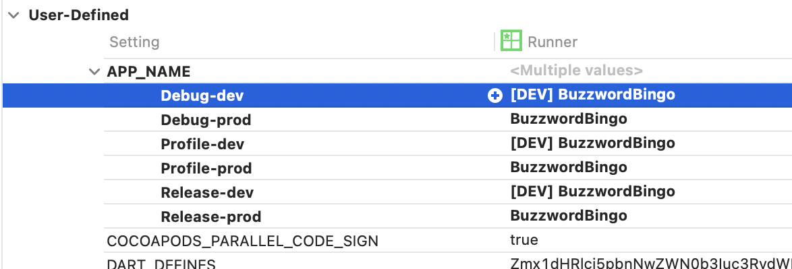
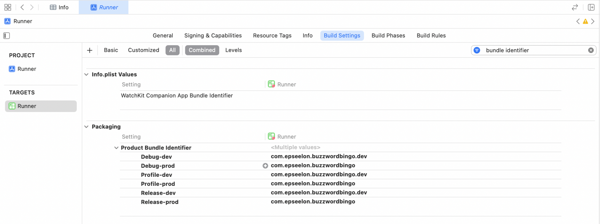

도토리 프로젝트를 본격적으로 시작하기 전의 사전작업들을 기록한다.

## 프로젝트 생성

안드로이드 스튜디오에서 New Flutter Project를 통해 앱을 생성한다.

android앱 내부의 **app수준 build.gradle**파일에 들어가면 `compileSdk`버전, `targetSdk`버전, `minSdk`버전이 아래처럼 설정 돼 있다.

~~~
android {
    ...
    compileSdkVersion flutter.compileSdkVersion
    ...

    defaultConfig {
        ...
        minSdkVersion flutter.minSdkVersion
        targetSdkVersion flutter.targetSdkVersion
        ...
    }
    
    ...
}
~~~

flutter의 설정을 따르도록 돼 있는데, 저 설정이 저장된 파일의 위치는 Flutter SDK내부이기 때문에 프로젝트 내부에서는 텍스트 검색을 통해 찾아볼 수가 없다.
Mac OS환경, Flutter 3.19.4버전 기준으로 해당 설정은 **~/Library/Flutter/packages/flutter_tools/gradle/src/main/groovy/flutter.groovy**파일에 저장돼 있다.

~~~
class FlutterExtension {
    /** Sets the compileSdkVersion used by default in Flutter app projects. */
    static int compileSdkVersion = 34

    /** Sets the minSdkVersion used by default in Flutter app projects. */
    static int minSdkVersion = 19

    /**
     * Sets the targetSdkVersion used by default in Flutter app projects.
     * targetSdkVersion should always be the latest available stable version.
     *
     * See https://developer.android.com/guide/topics/manifest/uses-sdk-element.
     */
    static int targetSdkVersion = 33
    
    ...
}
~~~

해당 설정이 Flutter 버전에 따라 바뀔 수 있기 때문에 직접 관리하기로 한다. **local.properties**파일에 아래처럼 작성한다.

~~~
flutter.flutterCompileSdkVersion=34
flutter.flutterTargetSdkVersion=34
flutter.flutterMinSdkVersion=23
~~~

다시 **app수준 build.gradle**파일로 돌아와 위 설정을 참조하도록 수정한다.

~~~
//  설정 3개를 불러옴
def flutterCompileSdkVersion = localProperties.getProperty('flutter.flutterCompileSdkVersion')
if (flutterCompileSdkVersion == null) {
    flutterCompileSdkVersio = '34'
}
def flutterTargetSdkVersion = localProperties.getProperty('flutter.flutterTargetSdkVersion')
if (flutterTargetSdkVersion == null) {
    flutterTargetSdkVersion = '34'
}
def flutterMinSdkVersion = localProperties.getProperty('flutter.flutterMinSdkVersion')
if (flutterMinSdkVersion == null) {
    flutterMinSdkVersion = '23'
}

//  불러온 설정값을 적용
android {
    ...
    compileSdk flutterCompileSdkVersion.toInteger()
    ...

    defaultConfig {
        ...
        minSdkVersion flutterMinSdkVersion.toInteger()
        targetSdkVersion flutterTargetSdkVersion.toInteger()
        ...
    }
    
    ...
}
~~~

## lint 설정

**pubspec.yaml**
~~~
dev_dependencies:
  ...
  flutter_lints: ^3.0.0 # 기본 설정되어 있는 lint셋
  build_runner: 2.4.6   # 플러터에서 코드 생성 기능을 제공해주는 플러그인
  riverpod_lint: #  riverpod에서 제공하는 lint셋
  custom_lint:  #   riverpod_lint가 사용하는 패키지
  ...
~~~

**analysis_options.yaml**
~~~
include: package:flutter_lints/flutter.yaml

analyzer:
  plugins:
    # dart run custom_lint 한번 실행해 줘야 riverpod_lint의 어시스트가 사용가능해 진다.
    - custom_lint 

custom_lint:
  enable_all_lint_rules: true

...

linter:
...
~~~

`dart run custom_lint`를 실행해서 riverpod_lint의 룰들을 생성한다. 

## riverpod 설정

상태관리로 Riverpod을 사용할 예정이기 때문에 **pubspec.yaml**에 디펜던시를 추가한다

**pubspec.yaml**
~~~
dependencies:
    ...
    flutter_riverpod: ^2.5.1
    ...
~~~

## Live Template 추가

Riverpod을 사용하는데 쓸만한 간단한 Live Template도 몇개 추가 해봄.

**ConsumerWidget 생성**

**ref.read()**

**ref.watch()**

이렇게 해두면 아래처럼 사용 가능.

## freezed 설정

[공식문서](https://pub.dev/packages/freezed)

freezed는 코드 제너레이터 패키지이다. 즉, 여러 용도의 코드를 자동생성해줌. 나는 데이터 모델 클래스를 생성하기 위해 사용하기로 한다.

**pubspec.yaml**
~~~
dev_dependencies:
  ...
  json_serializable:
  freezed:
~~~

보고 참고할 수 있게 아래처럼 예시를 하나 만들어 놓기로 한다.

**lib/model/schedule_model.dart**
~~~
import 'package:freezed_annotation/freezed_annotation.dart';

part 'schedule_model.freezed.dart';

part 'schedule_model.g.dart';

@freezed
class ScheduleModel with _$ScheduleModel {
  factory ScheduleModel({
    required String id,
    required String content,
    required DateTime date,
    required int startTime,
    required int endTime,
  }) = _ScheduleModel;

  factory ScheduleModel.fromJson(Map<String, dynamic> json) =>
      _$ScheduleModelFromJson(json);
}
~~~

위와 같이 작성 후 아래 명령어를 실행한다.

`flutter pub run build_runner build --delete-conflicting-outputs`

`part` 구문에 써둔 2개의 파일이 생성된다. 이제 이 ScheduleModel이라는 model클래스는 equal, copyWith등등 유용한 기능을 갖게 되었다.

## Flavor(dev, prod) 설정

build flavor를 dev, prod로 구분하기 위해 [이 링크](https://sebastien-arbogast.com/2022/05/02/multi-environment-flutter-projects-with-flavors/#Getting_Started)를 참고했다.

### Flavor별 Main파일 생성

**lib**폴더에 **app_config.dart**파일을 만들고 아래 코드를 작성한다.

~~~
import 'package:flutter/material.dart';

enum Environment { dev, prod }

class AppConfig extends InheritedWidget {
  final Environment environment;
  final String appTitle;

  const AppConfig({
    Key? key,
    required Widget child,
    required this.environment,
    required this.appTitle,
  }) : super(
    key: key,
    child: child,
  );

  static AppConfig of(BuildContext context) {
    return context.dependOnInheritedWidgetOfExactType<AppConfig>()!;
  }

  @override
  bool updateShouldNotify(covariant InheritedWidget oldWidget) => false;
}
~~~

**main_dev.dart**와 **main_prod.dart**파일을 만들고, 아래처럼 작성한다. 각 flavor별 main파일이므로 기존의 main.dart파일은 제거한다.

**main_dev.dart**
~~~
import 'package:myapp/my_app.dart';
import 'package:flutter/material.dart';
import 'package:flutter_riverpod/flutter_riverpod.dart';

import 'app_config.dart';

void main() {
  const configuredApp = AppConfig(
    environment: Environment.dev,
    appTitle: '[DEV] MyApp',
    child: MyApp(),
  );
  runApp(const ProviderScope(child: configuredApp));
}
~~~

**main_prod.dart**
~~~
import 'package:myapp/my_app.dart';
import 'package:flutter/material.dart';
import 'package:flutter_riverpod/flutter_riverpod.dart';

import 'app_config.dart';

void main() {
  const configuredApp = AppConfig(
    environment: Environment.prod,
    appTitle: 'MyApp',
    child: MyApp(),
  );
  runApp(const ProviderScope(child: configuredApp));
}
~~~

### Flavor 생성

**Run/Debug Configurations**를 열어서 build flavor를 2개 생성한다.

dev, prod 두가지를 생성해 주고, Dart entrypoint에 각 main파일을 지정한다.

### Android앱 설정

app 수준 **build.gradle**파일을 연다(android/app/build.gradle). 아래 설정 코드를 추가.

**app/build.gradle**
~~~
android{

  ...

  flavorDimensions "env"

    productFlavors {
        dev {
            dimension "env"
            applicationIdSuffix ".dev"
            resValue "string", "app_name", "[DEV] MyApp"
        }
        prod {
            dimension "env"
            resValue "string", "app_name", "MyApp"
        }
    }
}
~~~

AndroidManifest파일에서 앱 label도 수정한다.

**AndroidManifest.xml**
~~~
<application
        android:label="@string/app_name"
        ...
~~~

### iOS앱 설정

Xcode로 ios폴더를 연다.

Info탭의 Configurations를 아래처럼 수정한다.

상단 탭 바의 **Runner** 스킴을 클릭하고, **Manage Schemes**를 연다.

2가지 Scheme을 생성한다.

생성 후 **dev**를 더블클릭해 편집창으로 들어가서, **Run**의 Build Configuration을 **Debug-dev**로 세팅한다.

같은 방식으로 아래처럼 세팅한다.

**dev**

Run : Debug-dev 
Test : Debug-dev 
Profile : Profile-dev 
Analyze : Debug-dev 
Archive : Release-dev 

**prod**

Run : Debug-prod 
Test : Debug-prod 
Profile : Profile-prod 
Analyze : Debug-prod 
Archive : Release-prod 

완료했으면 다음으로 Info.plist 진입. **Bundle display name**를 **${APP_NAME}**로 변경.

다시 프로젝트 네비게이터의 루트에 있는 Runner를 클릭한 후 TARGETS의 Runnder로 진입한다. 상단 탭의 Build Settings를 클릭. 바로 아래 탭의 +버튼을 눌러 **Add User-Defined Setting**으로 진입한다.

APP_NAME을 각 빌드 설정별로 지정해 준다.

다음으로, 탭 바의 검색창을 통해 **bundle identifier**를 검색한다. 나타나는 **Product Bundle Identifier**를 세팅한다. dev설정일 때 value에 **.dev**를 붙여준다.

이제 다시 안드로이드 스튜디오로 돌아와 앱을 실행하면 각 Run Configuration별로 Build flavor가 설정되어 실행된다.

## 파이어베이스 프로젝트 설정

firestore와 storage, auth를 사용할 예정이다. 단 파이어베이스 프로젝트를 2개 만들어서 dev, prod flavor에 하나씩 연결할 것이다. 일단 파이어베이스 콘솔에서 프로젝트를 2개 만든다.

다음으로 커맨드라인에서 firebase를 사용하기 위해 firebase CLI와 flutterfire CLI설치해야 한다.

안드로이드 스튜디오로 다시 돌아와 프로젝트 루트 위치에서 터미널을 열고 다음 커맨드를 순서대로 실행하여 필요한 툴을 설치한 후 앱과 파이어베이스 프로젝트를 연결한다. 프로젝트 2개를 연결해야 하기 때문에 2개를 실행한다.

1. firebase-tools 설치
~~~
npm install -g firebase-tools
~~~

2. firebase CLI 로그인
~~~
firebase login
~~~

3. flutterfire CLI 설치
~~~
dart pub global activate flutterfire_cli
~~~

4. 앱의 **pubspec.yaml**에 아래 추가
~~~
dependencies:
  ...
  firebase_core: 2.19.0
  cloud_firestore: 4.11.0
~~~

5. dev용 프로젝트에 앱 연결
~~~
flutterfire configure -p [dev용 프로젝트 이름] -i [iOS앱 번들 id] -a [Android앱 id] -o lib/firebase/dev/firebase_options.dart --no-apply-gradle-plugins
~~~
**example** :
~~~
flutterfire configure -p myapp-dev-3n4b2 -i com.myapp.myapp.dev -a com.myapp.myapp.dev -o lib/firebase/prod/firebase_options.dart --no-apply-gradle-plugins
~~~

6. prod용 프로젝트에 앱 연결
~~~
flutterfire configure -p [prod용 프로젝트 이름] -i [iOS앱 번들 id] -a [Android앱 id] -o lib/firebase/prod/firebase_options.dart --no-apply-gradle-plugins
~~~

**example** : 
~~~
flutterfire configure -p myapp-9s78f -i com.myapp.myapp -a com.myapp.myapp -o lib/firebase/prod/firebase_options.dart --no-apply-gradle-plugins
~~~

5와 6을 실행하면 아래처럼 각 flavor에서 사용할 `firebase_options.dart`파일들이 생성된다. Api key값들이 들어있으므로 git ignore에 추가하는 것이 권장된다.

마지막으로 main파일의 main()함수에서 Firebase를 초기화 해 주면 사용 준비 완료.

**main_dev.dart**
~~~
void main() async {
  WidgetsFlutterBinding.ensureInitialized();

  await Firebase.initializeApp(
    options: DefaultFirebaseOptions.currentPlatform,
  );

  const configuredApp = AppConfig(
    environment: Environment.dev,
    appTitle: '[DEV] MyApp',
    child: MyApp(),
  );
  runApp(const ProviderScope(child: configuredApp));
}
~~~

**main_prod.dart**파일도 마찬가지로 수정한다.

### iOS앱에 파이어베이스 설정

ios/Podfile을 연다. 최상단의 코멘트 처리 돼 있는 ios버전 설정을 코멘트 해제해 준다.

~~~
# Uncomment this line to define a global platform for your project
platform :ios, '12'
~~~

최소 platform버전을 지정하는 곳인 모양인데, Firebase와 Firestore에서 요구하는 버전을 지정한다. 나는 디폴트값인 12로 설정함.

또, 같은 파일 아래쪽에 다음 코드를 추가

~~~
target 'Runner' do
  ...

  pod 'FirebaseFirestore', :git => 'https://github.com/invertase/firestore-ios-sdk-frameworks.git', :tag => '10.15.0'
end
~~~

tag의 버전은 달라질 수 있는데, 오류 발생시 오류 메시지에 필요한 버전안내가 나온다.

### android앱에 파이어베이스 설정

`local.properties`를 열어 `minSdk`버전을 21이상으로 설정한다. (상단의 프로젝트 설정 부분을 먼저 완료 해야한다.)

**local.properties**
~~~
flutter.flutterMinSdkVersion=23
~~~

다음은 `app/build.gradle`파일을 열어 다음과 같이 multidex를 설정해준다.

**app/build.gradle**
~~~
android {
    ...

    defaultConfig {
        ...

        multiDexEnabled true
    }

    ...
}

...

dependencies {
    implementation 'com.android.support:multidex:1.0.3'
}
~~~

이제 파이어베이스 사용 설정이 완료됐다.

## ci/cd 설정

CI/CD는 `Github Actions`를 통해서 빌드 후 `Firebase App Distribution`을 통해 배포하도록 할 것이다. 일단 git에 연결해 준다.

TODO